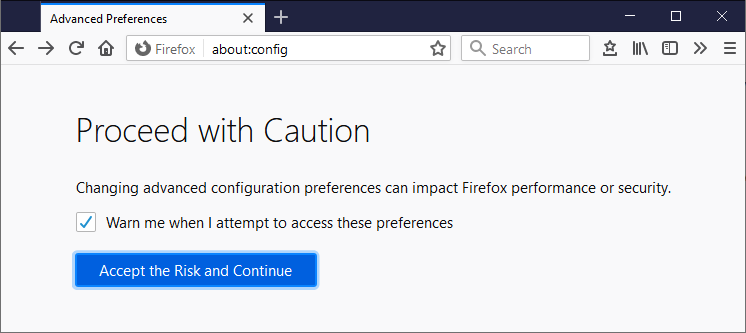

## Settings

{:.table .table-bordered .table-responsive-sm .w-auto .thead-dark}
| Setting                               | Value     |Description |
|---------------------------------------|-----------|------------|
| `browser.urlbar.autoFill`             | **`false`**   |            |
| `browser.urlbar.suggest.searches`     | **`false`**   |  |
| `browser.fixup.alternate.enabled`     | **`false`**   | **`false`**: The URL:s entered will be interpreted exactly as they are written.   **`true`**: If the lookup of the URL fails, Firefox will try with variants with a prefix and suffix (from the companion settings `browser.fixup.alternate.prefix` and `browser.fixup.alternate.suffix`) |

# Sources
[1] <https://chirale.org/2019/05/19/disable-search-and-autocomplete-on-url-bar-of-firefox/>
