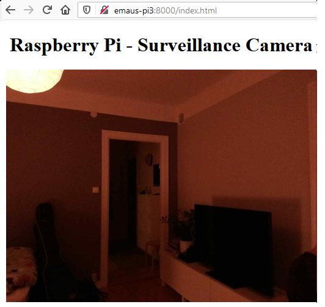

# Python web server
The bulk of the code is taken from [random nerd tutorials: Video Streaming with Raspberry Pi Camera](https://randomnerdtutorials.com/video-streaming-with-raspberry-pi-camera/).

## Installation
You need to install the Python package for accessing the Pi camera.

```bash
pip install picamera
```

## [The script](surv.py)
```python
# surv.py 


```

## Running
```bash
$ python surv.py --help
usage: surv.py [-h] [--size SIZE SIZE] [--frame-rate FRAME_RATE] [--port PORT]
               [--rotation ROTATION]

optional arguments:
  -h, --help            show this help message and exit
  --size SIZE SIZE      Size of captured images
  --frame-rate FRAME_RATE, -r FRAME_RATE
                        Frame rate of camera capture
  --port PORT, -p PORT  Port to serve website on
  --rotation ROTATION   Rotation of camera

$ python surv.py
```

Before changing video settings, make sure to [Picamera's page on sensor modes](https://picamera.readthedocs.io/en/latest/fov.html#sensor-modes). There are some connections between frame rate and resolution which would take time to figure out empirically. This was important for me, because I wanted the native aspect ratio and as high frame rate as possible.

Here is an excerpt for the V2 camera module with the settings I preferred:

{:.table .table-responsive}
| # | Resolution | Aspect Ratio | Framerates        | Video | Image | FoV  | Binning |
|---|------------|--------------|-------------------|-------|-------|------|---------|
| 4 | 1640x1232  | 4:3          | 1/10 <= fps <= 40 | x     |       | Full | 2x2     |

And the corresponding invocation:

```bash
$ python surv.py --size 1640 1232 --frame-rate 40 --rotation 180 -p 8000
```

## Result
Using your favorite web browser, you can then go to the IP address (or hostname if you have the luxury of mDNS) of the server:



I was quite astonished at the low latency of the stream! It is well under a second. Awesome! 🎉


### Monitoring traffic
I thought it would be possible to monitor the network traffic using the built-in developer tools in Firefox (accessed by pressing <kbd>F12</kbd>). However, the network logger does not update its stats until after an "image" has been downloaded completely. So we will only be able to get the statistics when the stream has ended. This is what is looks like while it is streaming:


# VLC server
VLC can be used from the command line to stream video with RTP (Real-Time Protocol) through RTMP (Real-Time Messaging Protocol). It's quite neat. 😊

There are several example on how to use this. See for example [Chis Carey's blog](https://chriscarey.com/blog/2017/04/30/achieving-high-frame-rate-with-a-raspberry-pi-camera-system/), and [Sammit](https://sammit.net/raspberry-pi-camera-streaming-to-vlc-player/).

## Installation
`raspivid` should already be installed, so you only need to install VLC.

```bash
apt install vlc
```

## Running

[`raspivid`](https://www.raspberrypi.org/documentation/usage/camera/raspicam/raspivid.md) has a bunch of flags that can be used for tweaking its output. It can rotate the video, apply video filters, change stream settings etc. Use `raspivid 2>&1 | less` for viewing its help with a pager.

### H.264
To set up an H264 video stream, use the following command:

```bash
$ raspivid -rot 180 -t 0 -fps 20 -w 640 -h 480 -o - |
    cvlc -vvv stream:///dev/stdin --sout '#rtp{access=udp,sdp=rtsp://:8554/stream}' :demux=h264
```

#### `raspivid` flags
* The most important flag to `raspivid` is `-t 0`, which makes the stream continue forever. Otherwise it would stop almost immediately.
* If you want to decrease the video bandwidth (possibly at the cost of latency), you can increase the GOP (Group Of Pictures) number. I.e. by adding the flag `-g 100`.
* You can directly decrease the maximum bandwidth (at the cost of quality) by using the flag `-b`. E.g. `-b 200000` for setting it to 200 kb/s.
* The framerate can be set (within limits, of course) using the `-fps`-flag. Note however that this increases the bandwidth, and possibly also the latency.

I didn't notice much change in latency when playing around with the settings. It was quite constant around 2-4 seconds depending on when the stream was started. Except for possibly when increasing the framerate.

### M-JPEG
VLC can also be used for setting up a Motion-JPEG stream using the following flags:
```bash
$ raspivid -cd MJPEG -rot 180 -t 0 -fps 20 -w 640 -h 480 -o - |
    cvlc -vvv stream:///dev/stdin --sout '#rtp{access=udp,sdp=rtsp://:8554/stream}' :demux=mjpeg
```

## Result
Open the stream in VLC by going to *Media* ➥ *Open Network Stream...* (<kbd>Ctrl</kbd> + <kbd>N</kbd>):


The latency of this stream is way higher than the [picamera stream](#python-web-server). For me it is at least 2 seconds, and can go up to around 6 seconds.

### Monitoring traffic
You can monitor the actual bitrate of the stream in VLC by going to *Tools* ➥ *Media information* (<kbd>Ctrl</kbd> + <kbd>I</kbd>), and then switching to the *Statistics* tab. This can be useful while tweaking the `raspivid` settings:


