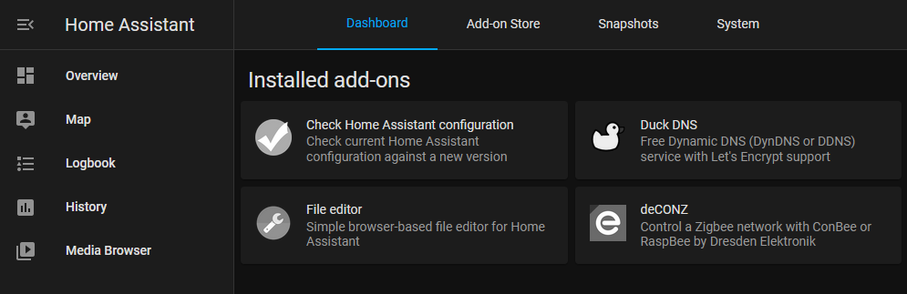

## Installation

This is the guide that I have followed for installing Home Assistant on Docker: <https://github.com/home-assistant/supervised-installer>

It is split in X steps:

1. Install prerequisites. This means the libraries and programs that are needed for the installation, such as Docker, NetworkManager, etc. ([see here](https://github.com/home-assistant/architecture/blob/master/adr/0014-home-assistant-supervised.md)).
2. Download the installer script:
    ```console
    $ curl -Lo installer.sh https://raw.githubusercontent.com/home-assistant/supervised-installer/master/installer.sh
    ```
3. Run the installer script for your specific machine configuration:
    ```console
    $ bash installer.sh --machine raspberrypi4  # Not rpi64(!)
    ```

You should now see a truckload of containers running when you run the command `docker ps` (except for the addons):
```console
$ docker ps -a
CONTAINER ID   IMAGE                                                        COMMAND                  CREATED        STATUS                  PORTS                                                                                                                          NAMES
e4e74391821e   homeassistant/armv7-addon-nginx_proxy:3.0.2                  "/init /run.sh"          26 hours ago   Up 26 hours             0.0.0.0:80->80/tcp, :::80->80/tcp, 0.0.0.0:443->443/tcp, :::443->443/tcp                                                       addon_core_nginx_proxy
e368bb8a7c82   homeassistant/armv7-addon-configurator:5.3.3                 "/init"                  26 hours ago   Up 26 hours                                                                                                                                            addon_core_configurator
667f0bd06813   ghcr.io/hassio-addons/node-red/armv7:10.0.0                  "/init"                  26 hours ago   Up 26 hours                                                                                                                                            addon_a0d7b954_nodered
5de96fd9b603   homeassistant/armhf-addon-deconz:6.10.0                      "/init"                  26 hours ago   Up 26 hours                                                                                                                                            addon_core_deconz
7cec24a697d0   homeassistant/armv7-addon-duckdns:1.13.0                     "/init /run.sh"          26 hours ago   Up 26 hours                                                                                                                                            addon_core_duckdns
639745b0716b   homeassistant/armv7-addon-mosquitto:6.0.1                    "/init"                  26 hours ago   Up 26 hours             0.0.0.0:1883-1884->1883-1884/tcp, :::1883-1884->1883-1884/tcp, 0.0.0.0:8883-8884->8883-8884/tcp, :::8883-8884->8883-8884/tcp   addon_core_mosquitto
7cb55f454264   homeassistant/armv7-hassio-multicast:2021.04.0               "/init"                  26 hours ago   Up 26 hours                                                                                                                                            hassio_multicast
2b0d613fa555   ghcr.io/home-assistant/armv7-hassio-cli:2021.08.1            "/init /bin/bash -c …"   26 hours ago   Up 26 hours                                                                                                                                            hassio_cli
4bdfdbf18f22   ghcr.io/home-assistant/armv7-hassio-audio:2021.07.0          "/init"                  26 hours ago   Up 26 hours                                                                                                                                            hassio_audio
1037d933ec74   ghcr.io/home-assistant/armv7-hassio-dns:2021.06.0            "/init"                  26 hours ago   Up 26 hours                                                                                                                                            hassio_dns
7bf259658e41   homeassistant/armv7-hassio-supervisor                        "/init"                  4 days ago     Up 26 hours                                                                                                                                            hassio_supervisor
8ea5f06d0c1f   ghcr.io/home-assistant/raspberrypi4-homeassistant:2021.8.8   "/init"                  7 days ago     Up 26 hours                                                                                                                                            homeassistant
1dddcf5c35d0   homeassistant/armv7-addon-check_config:3.8.0                 "/init"                  7 days ago     Exited (0) 7 days ago                                                                                                                                  addon_core_check_config
76315327b5ee   ghcr.io/home-assistant/armv7-hassio-observer:2021.06.0       "/init"                  2 months ago   Up 26 hours             0.0.0.0:4357->80/tcp, :::4357->80/tcp                                                                                          hassio_observer
```

This might seem daunting at first. But, basically, each program runs in its own container: like Home Assistant; a supervisor that keeps track of updates and the home assistant state; other helper containers; and addons.
Each container has its own version, state and log. All of which can be accessed either through Home Assistant (version and logs), or by using the docker commands.

## Migration
> Before migrating the files, make sure to stop Home Assistant. This can be done with the command `ha core stop` or `docker stop homeassistant`. When done, start it again by replacing *stop* with *start*.

The configuration files for the Dockerized Home Assistant are located under */usr/share/hassio/homeassistant*. Make sure to move your existing files there, if you have any (e.g. *configuration.yaml*, and possibly even login tokens).

## Install some addons
The next step would be to actually start using the supervised HA features, by for example, installing some addons:


